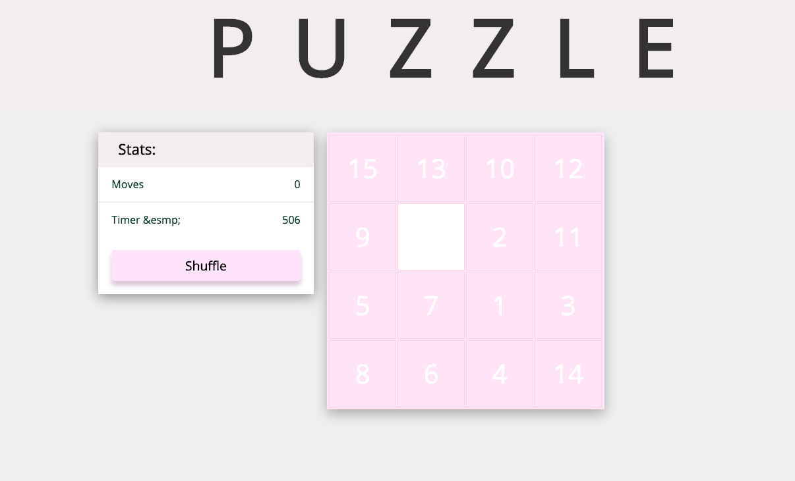

# About: 
Sliding puzzle in react. 

Still need to fix counting `moved` function.


---
## Used links:
[eqeqeq](https://eslint.org/docs/2.0.0/rules/eqeqeq)

[Shuffle Array](https://www.npmjs.com/package/shuffle-array)

[React doc](https://reactjs.org/docs/react-component.html)

[CSS-tricks](https://css-tricks.com/)

[Four ways to chunk an array](https://medium.com/@Dragonza/four-ways-to-chunk-an-array-e19c889eac4)

and some articles in Medium, Dev, Stack O. and Github.

---
```
Start: npm start
Opens on: port 3000
```
---


---

Andreas Heige | a@andreasheige.me | [andreasheige.me](https://andreasheige.me) 